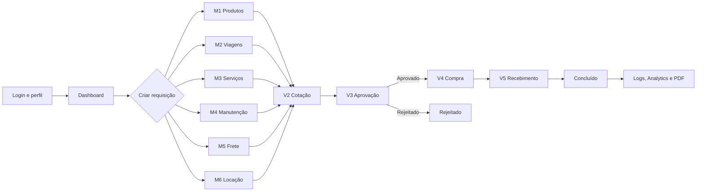
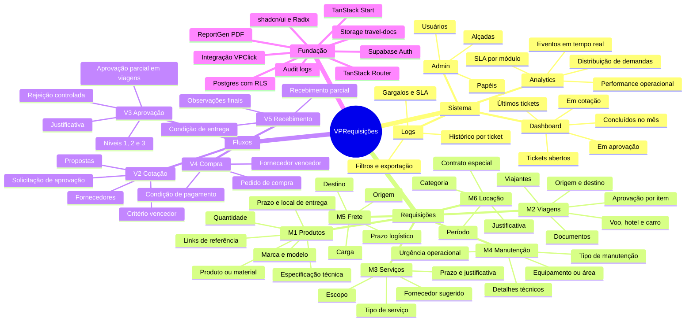
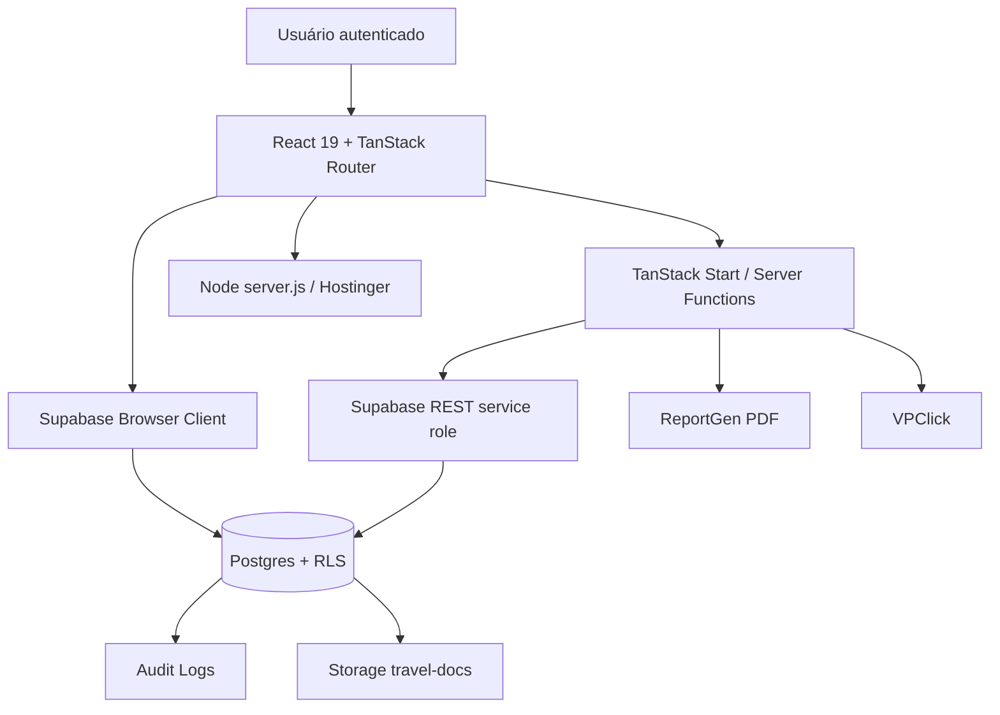

# VPRequisições

> Plataforma operacional da VerticalParts para centralizar requisições internas, organizar cotações, aprovações, compras, recebimentos, auditoria e indicadores em um fluxo único.

[](#stack)
[](#stack)
[](#arquitetura)
[](#visão-do-produto)

<p align="center">
  
</p>

## Visão do Produto

O **VPRequisições** é um sistema web para transformar pedidos internos em processos rastreáveis de compra e atendimento. Ele nasce para substituir controles dispersos por uma jornada padronizada: o solicitante cria a demanda, o comprador conduz a cotação, o aprovador decide conforme alçada, o comprador confirma a compra, o almoxarife registra o recebimento e a gestão acompanha tudo por dashboard, logs e analytics.

**Em uma frase:** um cockpit de requisições corporativas para saber quem pediu, o que pediu, por que pediu, quanto custa, quem aprovou, quando foi comprado e como foi recebido.

## Para Que Serve

- Centralizar requisições de produtos, viagens, serviços, manutenção, frete e locação.
- Padronizar campos mínimos, justificativas, urgência, prazos e anexos por tipo de solicitação.
- Criar trilha operacional de cotação, aprovação, compra e recebimento.
- Controlar papéis e permissões por perfil: solicitante, comprador, aprovador, almoxarife e admin.
- Registrar auditoria de ações e histórico de cada ticket.
- Apoiar decisões com dashboard, analytics, SLA e logs.
- Preparar documentação operacional em PDF e integração com VPClick.

## Onde Começa e Onde Termina

O fluxo começa quando um usuário autenticado acessa o painel e abre uma nova requisição em um dos módulos **M1 a M6**. A partir daí, o ticket ganha número, status, dados do módulo e histórico.

O fluxo termina quando a requisição chega ao status **CONCLUÍDO**, após passar por cotação, aprovação, compra e recebimento. Depois disso, o processo permanece disponível para consulta, auditoria, métricas, geração de evidência e análise gerencial.



## Árvore do Produto



## Galhos, Ramos e Folhas

| Galho | Ramos | Folhas operacionais |
|---|---|---|
| Sistema | Dashboard, Analytics, Logs, Admin | KPIs, filtros, SLA, auditoria, usuários, papéis e alçadas |
| Requisições | M1 a M6 | Formulários especializados por demanda, validações, urgência, prazos e anexos |
| Fluxos | V2 a V5 | Cotação, aprovação por nível, compra, recebimento e conclusão |
| Segurança | Auth, RLS, roles | Acesso autenticado, permissões por função e isolamento de dados no Supabase |
| Evidências | Logs, PDF, VPClick | Histórico rastreável, geração de documento e sincronização com tarefas externas |
| Operação | Deploy Node/Hostinger | Build Vite/TanStack, servidor Node fino e variáveis de ambiente controladas |

## Módulos de Requisição

| Código | Módulo | Finalidade |
|---|---|---|
| M1 | Produtos | Materiais, insumos, equipamentos, especificações técnicas e links de referência. |
| M2 | Viagens | Passagens, hospedagem, carro local, viajantes e documentos. |
| M3 | Serviços | Serviços técnicos, consultorias, projetos e demandas terceirizadas. |
| M4 | Manutenção | Manutenção corretiva, preventiva e preditiva. |
| M5 | Frete | Transporte, origem, destino, carga e logística. |
| M6 | Locação | Locação temporária de equipamentos, veículos e recursos de apoio. |

## Fluxo Operacional

| Etapa | Nome | Responsável típico | Resultado |
|---|---|---|---|
| Entrada | Requisição | Solicitante | Ticket aberto com módulo, justificativa, urgência e prazo. |
| V2 | Cotação | Comprador | Fornecedores comparados, propostas registradas e vencedor indicado. |
| V3 | Aprovação | Aprovador | Decisão por alçada, justificativa e trilha auditável. |
| V4 | Compra | Comprador | Compra confirmada com fornecedor, valor, pedido e condição. |
| V5 | Recebimento | Almoxarife | Entrega registrada, condição validada e processo concluído. |
| Pós-fluxo | Auditoria | Gestão/Admin | Logs, SLA, analytics e PDF para consulta futura. |

## Experiência de Interface

A aplicação foi desenhada como uma ferramenta operacional, não como uma landing page. A navegação lateral separa o trabalho em três blocos fáceis de escanear:

- **Sistema:** Dashboard, Analytics, Logs e Admin.
- **Requisições:** Produtos, Viagens, Serviços, Manutenção, Frete e Locação.
- **Fluxos:** Cotação, Aprovação, Compra e Recebimento.

A interface usa componentes Radix/shadcn, ícones Lucide, cartões de status, tabelas de tickets, dialogs por etapa e feedback por toast. A linguagem visual é corporativa e direta: foco em clareza, fila de trabalho, rastreabilidade e velocidade de operação.

## Arquitetura



### Stack

- **Frontend:** React 19, Vite, TypeScript, TanStack Router, TanStack Start.
- **UI:** Tailwind CSS 4, Radix UI, shadcn/ui, Lucide React, Sonner, Recharts.
- **Dados:** Supabase Auth, Supabase Postgres, Row Level Security, Storage.
- **Servidor:** Server Functions, Supabase REST com service role em rotinas controladas, `server.js` para runtime Node.
- **Qualidade:** Vitest, Testing Library, ESLint e Prettier.
- **Deploy:** Hostinger Node.js Web App com Node 22.x.

## Segurança e Governança

- Autenticação via Supabase Auth.
- Tabelas críticas com Row Level Security.
- Papéis operacionais: `admin`, `comprador`, `aprovador`, `almoxarife` e perfis de solicitante.
- Alçadas de aprovação em níveis 1, 2 e 3.
- Logs de auditoria para eventos de criação, cotação, aprovação, compra, recebimento e integrações.
- Storage dedicado para documentos de viagem (`travel-docs`).
- Mensagens amigáveis para erros Supabase/PostgREST.

## Banco de Dados

As migrations em `database/` estruturam o produto em torno de:

- `profiles` e `user_roles` para identidade e permissões.
- `requisitions` como entidade central do processo.
- `quotations` e `quotation_suppliers` para comparação de propostas.
- `approvals` e `approval_items` para decisão por alçada e por item.
- `purchases` para fechamento da compra.
- `receipts` para recebimento e conclusão.
- `audit_logs` para rastreabilidade.
- `settings` para parâmetros administrativos.
- `requisition_items` para itens especializados, como viagens.

## Qualidade e Testes

O projeto inclui testes para pontos críticos da experiência e das regras de negócio:

- Estrutura da navegação lateral e rotas principais.
- Tabela de tickets, urgências, status e estados vazios.
- Dashboard e módulos.
- Fluxos de cotação, aprovação, compra e recebimento.
- Analytics, SLA, filtros e exportação.
- Regras de formulário do M1 Produtos, incluindo etapas, validações, limites e contadores.

## Como Rodar Localmente

```bash
npm install
npm run dev
```

Crie um arquivo `.env` baseado em `.env.example`:

```env
VITE_SUPABASE_URL=
VITE_SUPABASE_ANON_KEY=
SUPABASE_SERVICE_ROLE_KEY=
PORT=3000
HOST=0.0.0.0
APP_ORIGIN=http://localhost:3000
REPORTGEN_API_KEY=
VPCLICK_URL=
VPCLICK_SERVICE_KEY=
VPCLICK_LIST_ID=
```

## Build e Deploy

```bash
npm run build
npm run start
```

Configuração recomendada para Hostinger:

| Item | Valor |
|---|---|
| Tipo | Node.js Web App |
| Node.js | 22.x |
| Build command | `npm run build` |
| Start command | `npm run start` |
| Entry file | `server.js` |
| Output | `dist` |

Validação mínima depois do deploy:

1. Acessar `/login` e autenticar com usuário real.
2. Criar uma requisição em `/products`.
3. Confirmar entrada em `/quoting`.
4. Aprovar em `/approval`.
5. Fechar compra em `/purchasing`.
6. Registrar recebimento em `/receipt`.

## Status do Produto

Este repositório já contém a base funcional do portal, com navegação, autenticação, módulos, fluxos, banco, RLS, testes e deploy Node preparado. O documento de deploy indica que o caminho principal **Produtos -> Cotação -> Aprovação -> Compra -> Recebimento** é o fluxo prioritário para validação controlada.

Pendências não bloqueantes mapeadas no próprio projeto:

- Algumas rotas especializadas ainda podem evoluir de dados mockados para backend real completo.
- Analytics e logs pedem fechamento de backend para operação ampla.
- Antes do uso geral, contas de teste devem ser substituídas por usuários operacionais reais.

## Roadmap Recomendado

| Fase | Objetivo | Entrega |
|---|---|---|
| 1 | Consolidar fluxo principal | M1 completo com cotação, aprovação, compra e recebimento em produção controlada. |
| 2 | Fortalecer módulos M2-M6 | Persistência completa, validações finais e anexos por módulo. |
| 3 | Gestão em tempo real | Analytics conectados a dados reais, SLA por etapa e alertas. |
| 4 | Evidência executiva | PDFs padronizados, exportações e painéis por período/departamento. |
| 5 | Integrações | VPClick, notificações, automações e rotinas de acompanhamento. |
| 6 | Escala operacional | Perfis reais, políticas refinadas, monitoramento e governança de produção. |

## Identidade do Projeto

- **Nome:** VPRequisições
- **Organização:** VerticalParts
- **Repositório:** `verticalpartsIA/Requisicoes`
- **Domínio funcional:** compras, requisições internas, aprovação, recebimento e auditoria
- **Público:** solicitantes internos, compradores, aprovadores, almoxarifado, gestores e administradores

## Resumo Executivo

O VPRequisições é uma plataforma de operação interna que organiza pedidos corporativos do início ao fim. Ela dá forma ao processo, reduz perda de informação, cria evidência de decisão, melhora governança de compras e entrega à gestão uma visão clara das demandas abertas, gargalos, aprovações, compras e recebimentos.

É um produto com vocação de portal operacional: começa na necessidade de um colaborador, atravessa a cadeia de compras e termina com recebimento, auditoria e inteligência para gestão.
